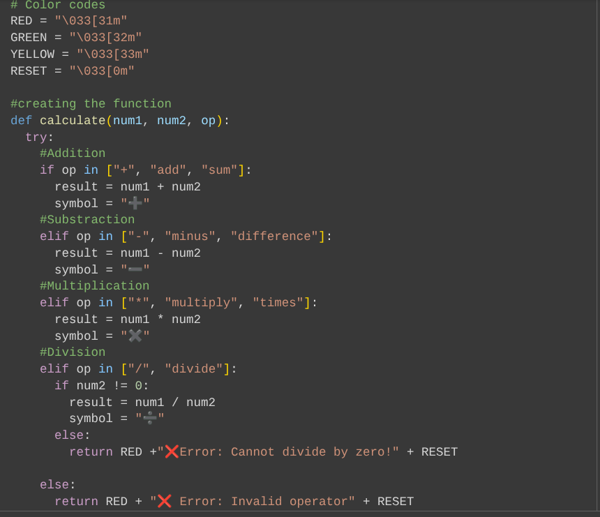
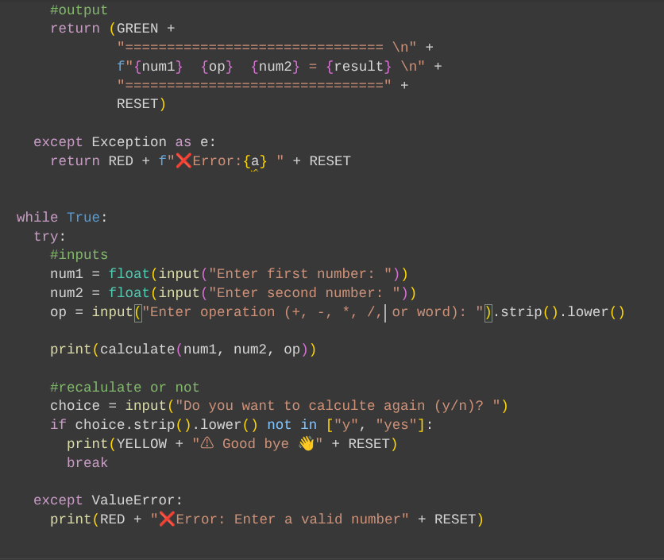
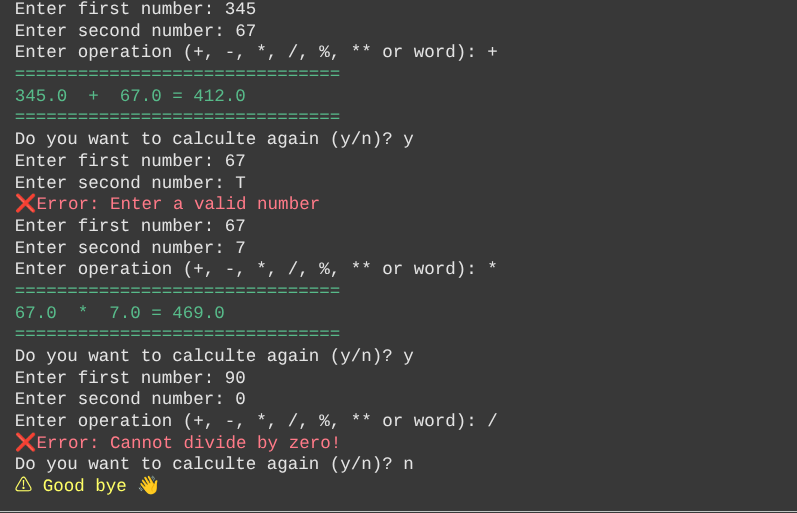

# Python Calculator

A beginner-friendly Python calculator built in Google Colab, demonstrating reusable functions, error handling, and console formatting.

## Features
- Addition, subtraction, multiplication, and division
- Reusable functions for each operation
- Error handling for invalid inputs
- Fancy console formatting for easy readability

## Skills Demonstrated
- Python programming
- Functions and modular code
- Conditional statements and loops
- Error handling
- Console output formatting

## How to Run
1. Download the `Python-Calculator.ipynb` file.
2. Open it in Google Colab or Jupyter Notebook.
3. Run all cells to start using the calculator.

## Screenshot
## Screenshot

## Run the Calculator
You can run this project live in Google Colab by clicking the link below:

[Open in Colab](https://colab.research.google.com/github/TirasCE/Python-Calculator/blob/main/Python-Calculator.ipynb)
